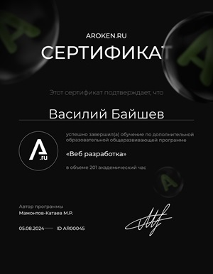

## Vasily Baishev

---

### My contacts

- **Address:** Kosareva str. Saransk, Mordovia
- **Phone:** +7 952 078 56 99
- **Email:** wasnik7819@gmal.com
- **GitHub:** [wasiliy19](https://github.com/wasiliy19/)
- **Telegram:** [WasNike](https://t.me/WasNike)
- **Discord:** wasiliy19

---

## About Me

My name is Vasily, I am an aspiring frontend developer, full of enthusiasm and aspiration to develop in the field of web development. Despite my little experience, I have already mastered the basic technologies required to create modern web applications, including HTML5, CSS3 and basic JavaScript.
My journey in IT began by learning the basics of programming and web technologies on my own. I successfully completed one online frontend course and implemented several small projects.
My goal is to become a professional developer. That's why I'm here.

---

## My skills

- HTML5,CSS3, BEM
- JavaScript(Основы)
- Figma, Adobe Photoshop
- Git, GitHub

---

### Code example:

1.Создайте функцию "cityInfo" с двумя параметрами,
которая возвращает строку
"London is at the index 0 in the myCities array"

2.Переберите все элементы массива "myCities", для каждого элемента вызовите функцию "cityInfo"
и выведите в консоль результат вызова функции

```
const myCities = ['London', 'New York', 'Singapore']

const cityInfo = (city, index) =>
	`${city} is at the index${index} in the myCities array`


myCities.forEach((city, index) => console.log(cityInfo(city, index)))
```

---

### Courses:

Web development courses at Aroken.ru online school (completed)


